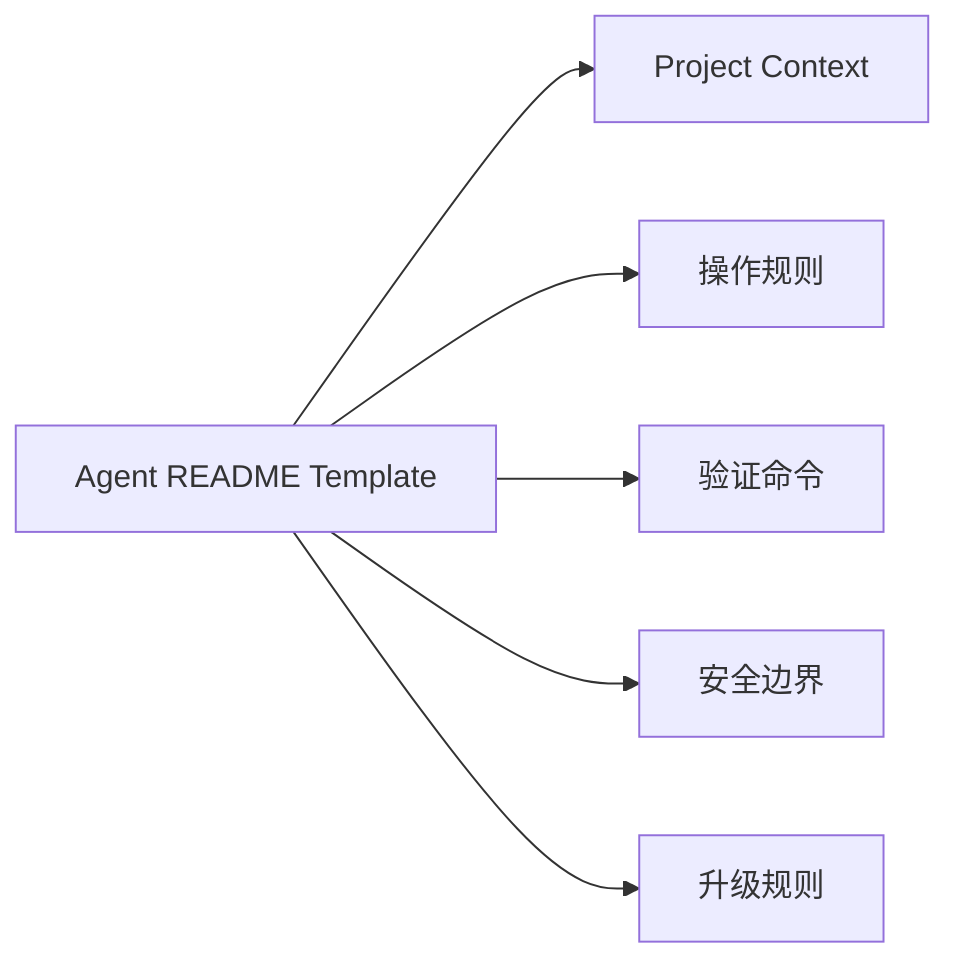

# Agent README Template

## Problem

团队经常临时编写 AI Agent 指令。有些文档过于模糊，有些过长，还有些把持久工程规则和临时任务备注混在一起。

缺少模板时，Agent README 的质量取决于个人写作风格，而不是工程需要。

## Solution

为面向 Agent 的文档使用标准模板。模板应帮助维护者一致地描述仓库 Context、角色边界、Workflow 和验证要求。

## Architecture



## Example

```md
# Agent Instructions

## Project Context

说明仓库用途和主要架构边界。

## Working Rules

- 优先做小范围、有明确作用域的变更。
- 修改行为前先阅读现有代码。
- 未经批准不要引入新依赖。

## Validation

- Unit tests:
- Lint:
- Type check:

## Safety Boundaries

- 除非明确要求，不要 push。
- 不要修改密钥或生产配置。
- 执行破坏性操作前先询问。

## Escalation

当需求冲突、测试无法运行或需要外部系统时，向人类确认。
```

## Trade-offs

收益：

- 提升跨仓库的一致性
- 让指令更容易 Review
- 区分持久规则和任务备注
- 降低新 Agent 的上手成本

成本：

- 模板可能鼓励样板化内容
- 未使用的章节可能过期
- 过于通用的指令可能无法影响行为
- 需要维护者删除无关章节

## Best Practices

- 只保留会影响 Agent 行为的章节。
- 优先使用明确命令和边界，而不是泛泛建议。
- 对 git、迁移、外部 API 等高风险 Workflow 提供示例。
- 在真实 Agent 失败后 Review 模板。
- 避免把模板当作项目文档的堆放处。
