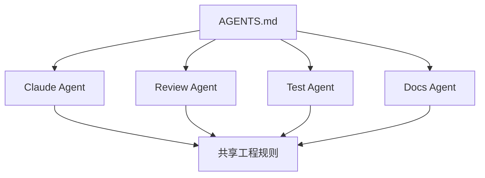

# AGENTS.md Best Practice

## Problem

不同 AI Coding 工具和 Agent 可能在同一仓库中工作。如果每个工具收到的指令不同，团队会得到不一致的变更、重复的说明和不清晰的安全边界。

典型问题包括：

- 一个 Agent 运行的验证步骤与另一个不同
- Review Agent 和 Implementation Agent 之间没有协作契约
- 仓库约定散落在不同 Prompt 中
- 工具特定文件随着时间推移发生漂移

## Solution

将 `AGENTS.md` 作为面向 AI Agent 的工具无关指令层。它应定义共享的仓库期望，同时允许工具特定文件补充本地细节。

一个实用结构包括：

- 仓库概览
- Agent 角色
- 允许与禁止的操作
- 验证要求
- 文件 Owner 与敏感区域
- 沟通规则
- 升级条件

## Architecture



## Example

```md
## Agent Roles

- Implementation Agent：可以编辑源文件和测试。
- Review Agent：可以检查 diff 并建议修改，但不应提交。
- Test Agent：可以运行验证命令并报告失败。

## Safety

- 未经人类明确批准，不要 push、deploy、删除分支或修改 CI secrets。
```

这为多个 Agent 提供了共同的操作模型。

## Trade-offs

收益：

- 标准化不同工具中的 AI 行为
- 明确 Agent 职责
- 减少 Prompt 重复
- 支持 Multi-Agent Workflow

成本：

- 可能与工具特定指令文件重叠
- 需要清晰的优先级规则
- 如果没有绑定仓库操作，可能变得过于通用
- 团队 Workflow 变化时需要更新

## Best Practices

- 将 `AGENTS.md` 视为共享契约，而不是教程。
- 在引入多个 Agent 前先定义角色边界。
- 必要时把工具特定细节保留在工具特定文件中。
- 文档化指令冲突时哪个文件优先。
- 为模糊、破坏性或共享状态操作加入升级规则。
- 示例应保持可操作且与仓库相关。
