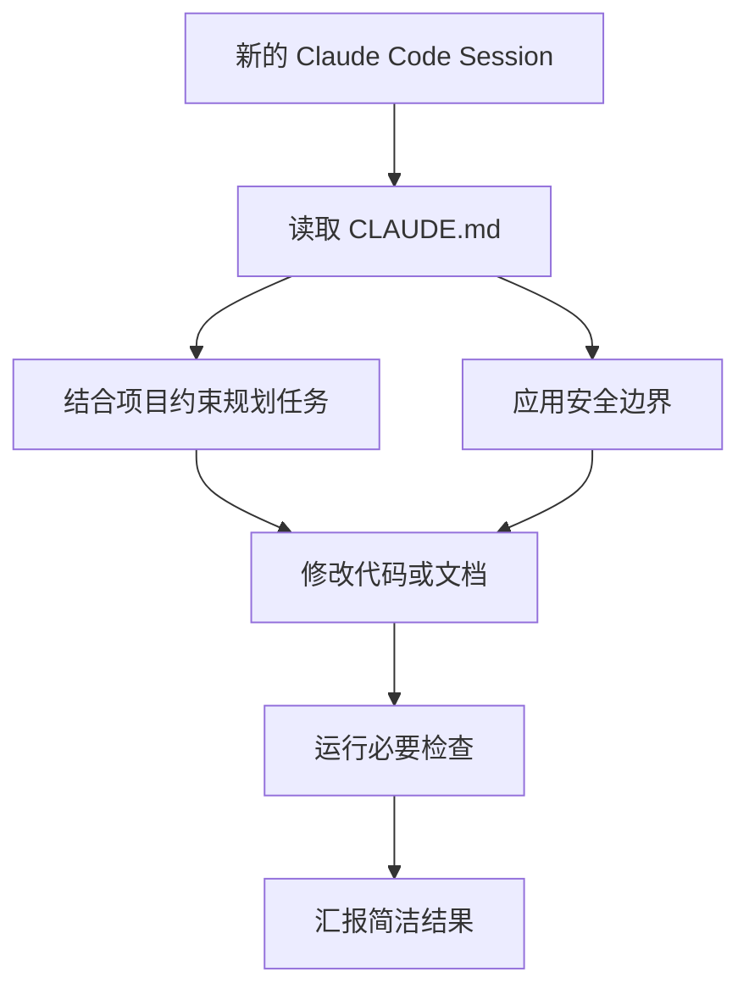

# CLAUDE.md Best Practice

## Problem

AI Coding Agent 通常从不完整的项目 Context 开始工作。没有稳定的指令文件时，用户需要在聊天中反复解释仓库结构、命令、编码规则和安全边界。

这会造成行为不一致：

- Agent 猜测构建和测试命令
- 项目特定约束被遗忘
- 危险或高噪声操作需要反复纠正
- 新 AI Session 的启动成本变高

## Solution

维护一个项目级 `CLAUDE.md`，为 Agent 提供简洁、持久的操作指令。该文件应描述如何在仓库中工作，而不是复制所有项目文档。

推荐章节：

- 项目目标
- 常用命令
- Testing 与验证
- 代码风格和架构边界
- 安全操作与禁止行为
- Review 期望
- 已知外部引用

## Architecture



## Example

有用的指令应具体且可操作：

```md
## Testing

- 运行 `pnpm test` 执行 unit tests。
- 提交 frontend 变更前运行 `pnpm lint`。
- 涉及 migration 的变更不要使用 mocked database tests。
```

薄弱的指令通常过于宽泛，难以执行：

```md
Always write good code and be careful.
```

## Trade-offs

收益：

- 减少重复 Context 设置
- 提升跨 Session 一致性
- 让 AI 行为可 Review
- 文档化操作边界

成本：

- 命令变化后可能过期
- 可能被填入过多细节
- 需要维护者保持简洁
- 如果复制更权威的文档，可能产生冲突

## Best Practices

- 指令应简短、稳定、可执行。
- 链接详细文档，而不是复制它们。
- 只有在命令当前有效且有人维护时才写入。
- 区分持久规则和临时项目备注。
- 为 git、部署、凭证和破坏性操作添加明确安全边界。
- 在重大工具或流程变化后 Review `CLAUDE.md`。
