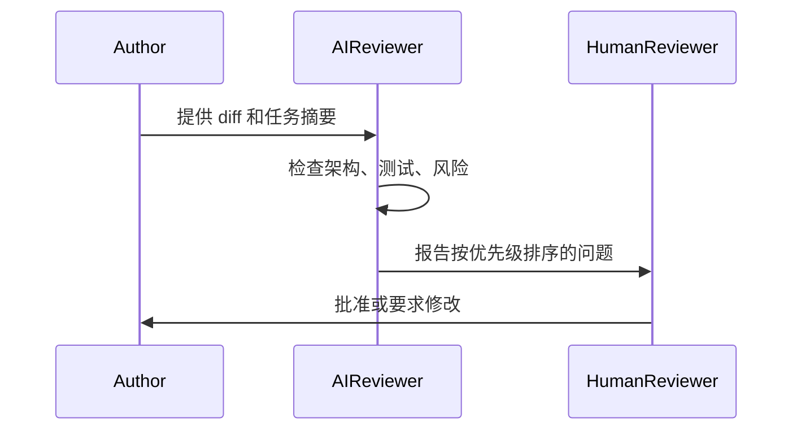

# AI Code Review Case

## Scenario

一个团队在常规功能开发中采用 AI Coding 辅助。由于实现速度更快，Pull Request 变得更大。Human Reviewer 发现局部正确性通常可以接受，但架构一致性问题更难发现。

示例包括：

- 新工具函数重复了已有模式
- 错误处理方式与相邻模块不一致
- 测试覆盖了 happy path，但没有覆盖恢复路径
- 生成代码绕过了既有边界

## Goal

引入 AI Reviewer，在不替代 Human Approval 的前提下降低 Review 负担。

团队希望：

- 更早发现一致性问题
- 让 Review 反馈更系统
- 保留人类责任
- 避免用高噪声 AI 评论阻塞每个变更

## Implementation

团队创建一份 Review checklist，聚焦工程风险，而不是风格偏好。

AI Reviewer 的输出采用结构化格式：

- Blocking Risks
- Non-blocking Concerns
- Missing Validation
- Questions for Human Reviewer

团队明确禁止 AI Reviewer 批准变更。

## Result

Review 评论变得更一致。Human Reviewer 在重复检查上花费更少时间，把更多精力放在产品、架构和 ownership 决策上。

团队还识别出 AI 生成中的常见问题，并更新项目指令，以便在 Workflow 更早阶段预防这些问题。

## Lessons Learned

- AI Review 最有价值的定位是风险扫描器，而不是批准权威。
- Checklist 可以提升信号质量。
- 发现的问题应引用具体文件、diff 或行为。
- AI Review 不应替代领域 ownership。
- 最好的 Review 改进会反馈到实现指令中。
