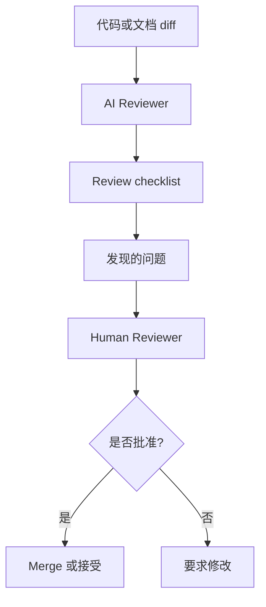

# AI Reviewer Pattern

## Problem

随着 AI 生成的变更变大，Human Reviewer 面临更高的 Review 负担。挑战不只是发现语法错误。Reviewer 需要发现架构漂移、缺失测试、不一致假设，以及局部看似正确但削弱长期可维护性的变更。

通用 AI Agent 可以提供帮助，但前提是它的 Reviewer 角色被清晰定义。

## Solution

将 AI Reviewer 作为对拟议变更的结构化二次检查。AI Reviewer 应聚焦风险发现和一致性检查，而不是最终批准。

推荐 Review 维度：

- 需求对齐
- 架构边界一致性
- 测试覆盖和验证缺口
- 安全与数据处理风险
- State 与 retry 行为
- 可维护性与可读性

## Architecture

## Example

对于修改 retry 行为的 Pull Request，AI Reviewer 不应只检查格式。它应询问：

- retry 操作是否幂等？
- 外部副作用是否受到保护？
- 失败 State 是否可观测？
- 测试是否覆盖部分失败？
- 实现是否符合现有架构边界？

## Trade-offs

收益：

- 减少 Reviewer 盲区
- 建立一致的 Review 覆盖
- 捕捉跨领域风险
- 帮助 Reviewer 专注于判断

成本：

- 可能产生误报
- 可能遗漏项目特定 Context
- 不应替代人类 ownership
- 需要维护 Review checklist

## Best Practices

- 给 AI Reviewer 明确且窄的 Review 契约。
- 要求问题基于 diff 或仓库状态提供证据。
- 按严重程度区分发现的问题。
- 避免让 Reviewer 批准自己的实现。
- 最终决策应保留给人类维护者。
- 在真实 Review 漏洞出现后更新 checklist。
