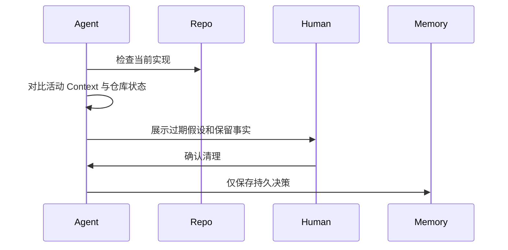

# Context Cleanup Case

## Scenario

一个团队使用 AI Agent 将服务从一个内部 API 迁移到另一个内部 API。任务跨越多个 Session。迁移早期，Agent 记录了关于 endpoint 名称、测试缺口和临时兼容 shim 的假设。

随着迁移推进，其中一些假设已经变错，但仍留在工作 Context 中。

## Goal

清理任务 Context，让 AI Agent 基于当前已验证状态继续工作，而不是携带过时的迁移历史。

团队希望：

- 移除过期假设
- 保留最终决策
- 让未解决风险保持可见
- 避免污染长期 Project Memory

## Implementation

团队在每个迁移里程碑结束时增加清理步骤：

清理输出拆分为：

- 已验证的当前 State
- 已移除的假设
- 未解决风险
- 持久决策

临时迁移细节保存在任务备注中，不提升为 Project Memory。

## Result

Agent 不再建议已经被拒绝的兼容路径。未来 Session 从当前迁移状态开始，而不是从所有失败尝试的完整历史开始。

团队也降低了 Review 摩擦，因为 AI 生成的变更更符合最新架构方向。

## Lessons Learned

- Context Cleanup 在里程碑之后最有用，而不只是在失败之后。
- 仓库应被视为实现状态的可信源。
- 过期 Context 应明确移除，而不是仅靠新备注反驳。
- 持久 Memory 应保存稳定决策，而不是迁移噪声。
- 当删除的 Context 可能包含业务理由时，人工确认很有价值。
