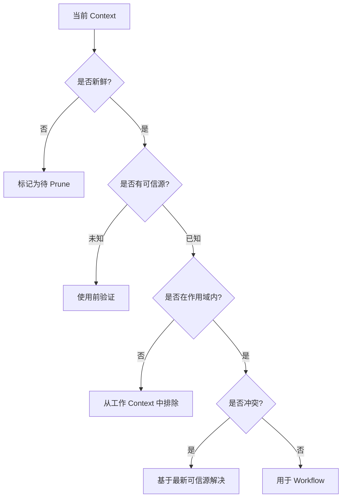

# Context Debt Detection

## Problem

Context Debt 很难识别，因为它并不总是产生明显错误。AI 可能仍在继续工作，但它的决策已经受到过期假设、无关历史或冲突指令的影响。

常见信号包括：

- Agent 重复已经被证伪的假设
- 旧需求覆盖新的用户输入
- 摘要保留了早期回合中的错误
- 检索到的 Context 很长，但与决策无关
- Agent 提问变少，但准确性下降

## Solution

在 Workflow 边界增加显式检测检查。目标是在受污染或过期的 Context 影响实现决策之前识别它。

检测维度：

- Freshness：Context 是否仍然当前有效？
- Authority：可信源是什么？
- Scope：该 Context 是否适用于当前任务？
- Conflict：它是否与更新的信息冲突？
- Utility：它是否会改变下一步行动？

## Architecture

## Example

在一次长期重构中，Agent 记得某个服务使用 REST endpoints。后来团队把目标路径迁移到 GraphQL。如果旧的 REST 假设仍留在 Context 中，Agent 可能会在错误层生成集成变更。

检测步骤应询问：

- REST 假设来自哪里？
- 当前代码是否仍在使用它？
- 当前任务是否针对已迁移路径？
- 用户是否提供了更新的约束？

## Trade-offs

收益：

- 捕捉静默的 Context 漂移
- 提升长时间运行 Workflow 的可靠性
- 减少重复错误
- 形成验证假设的习惯

成本：

- 增加 Workflow 开销
- 可能拖慢简单任务
- 需要访问可信源
- 如果机械套用，可能变得官僚化

## Best Practices

- 在主要实现步骤前运行 Context 检查。
- 将旧摘要视为线索，而不是事实。
- 优先相信当前仓库状态，而不是记忆中的描述。
- 明确丢弃已经被证伪的假设。
- 为当前任务维护一份简短的活动约束清单。
- 当两个权威来源冲突时，请人类确认。
