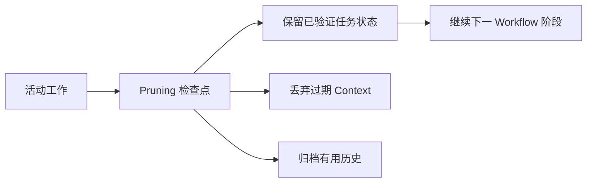

# Context Pruning Pattern

## Problem

长时间运行的 AI Workflow 会积累中间推理、失败尝试、过期文件路径和临时用户指令。如果所有内容都保持活动状态，后续决策可能基于不再代表当前任务状态的 Context。

问题不只是 Context 长度，而是 Context 相关性。

## Solution

引入 Pruning 检查点，将活动 Context 缩减为进入下一阶段所需的最小事实集合。

Pruning 检查点应保留：

- 当前目标
- 已接受约束
- 已验证事实
- 未决决策
- 下一步行动

应移除或归档：

- 失败假设
- 过期实现路径
- 重复日志
- 已解决错误
- 无关对话历史

## Architecture

## Example

Agent 尝试三种方法修复测试失败。前两种失败，因为假设的 API 形状是错误的。读取真实类型定义后，Agent 找到了正确路径。

继续之前，活动 Context 应被 Prune 为：

- 真实 API 形状
- 最终选择的实现路径
- 仍失败的测试
- 下一条验证命令

失败假设不应继续作为活动指导。

## Trade-offs

收益：

- 降低长 Workflow 中的噪声
- 提升决策质量
- 让任务交接更容易
- 降低重复失败路径的风险

成本：

- 可能丢弃有用的排查历史
- 需要判断哪些内容仍然相关
- 过度 Pruning 可能丢失决策理由
- 需要明确的检查点节奏

## Best Practices

- 在重大失败、需求变化或里程碑完成后执行 Pruning。
- 保留决策和证据，而不是保留大量原始对话。
- 明确保留未解决问题。
- 将归档历史与活动工作 Context 分离。
- 使用简洁的 State 摘要，而不是宽泛叙述式摘要。
- 执行高风险操作前，用代码或权威文档验证活动 Context。
