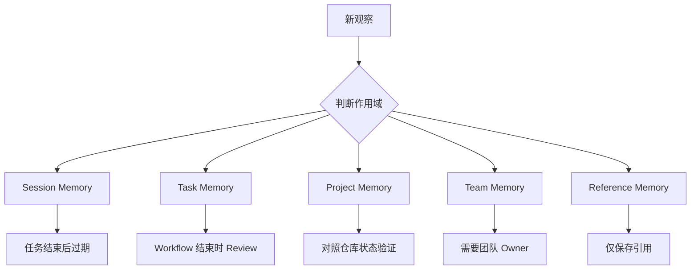

# Memory Layer Pattern

## Problem

AI 系统常把 Memory 当成一个统一容器来使用。项目规则、临时任务备注、用户偏好、历史决策和失败尝试被混在一起保存。随着时间推移，Agent 很难区分哪些是稳定知识，哪些只是短期 Context。

这会带来多种工程风险：

- 临时约束被误当作长期假设
- 过期决策覆盖当前项目状态
- 低可信度备注被当作事实复用
- 任务级噪声污染项目级行为

## Solution

基于生命周期、作用域和可信度，把 Memory 拆分为明确的层。每一层都应有清晰的负责人、更新规则和删除规则。

常见分层包括：

- Session Memory：当前任务状态和短期备注
- Task Memory：单个 Workflow 中的决策和约束
- Project Memory：持久的项目约定和偏好
- Team Memory：协作规范和共享工程规则
- Reference Memory：指向外部系统或可信源文档的引用

## Architecture

## Example

一个 Coding Agent 在功能任务中学习到三件事：

1. 当前缺陷影响 checkout 的重试行为。
2. 团队偏好为支付流程编写集成测试。
3. 重试设计记录在内部架构页面中。

采用 Memory 分层的系统应分别存储：

- 缺陷细节：Task Memory
- 测试偏好：如果确认具备长期有效性，存入 Project Memory 或 Team Memory
- 架构页面：Reference Memory

不应把这三类信息都作为通用长期 Memory 保存。

## Trade-offs

收益：

- 减少长期 Memory 污染
- 提升 Context 检索精度
- 让 Memory Review 和清理更容易
- 明确信息是否可以影响未来任务

成本：

- 需要制定分类规则
- 引入 Memory 维护开销
- 持久 Memory 可能需要人工确认
- 分层过严时可能遗漏有用 Context

## Best Practices

- 只保存会改变未来行为的信息。
- 尽可能附带来源、时间戳和可信度。
- 对外部系统优先保存引用，而不是复制内容。
- 只有经过 Review 后，才把 Task Memory 提升为 Project Memory。
- 当可信源变化时，删除或归档对应 Memory。
- 复用前要基于当前仓库验证文件路径、命令和约定。
