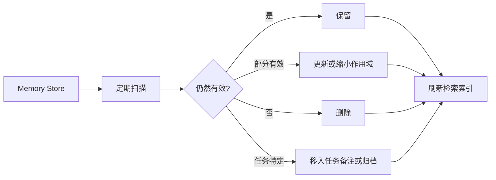

# Memory Pruning Strategy

## Problem

长期 Memory 不会天然有用。持续保存每一条摘要、偏好、决策和任务备注的 AI 系统，最终会积累过期或相互冲突的 Context。

常见表现包括：

- Agent 引用已经不存在的规则
- 项目约定与当前代码冲突
- 旧实现细节影响新的决策
- Memory 检索返回内容冗长但价值较低

## Solution

引入 Pruning 策略，基于新鲜度、正确性和未来效用，定期删除、更新或降级 Memory。

一个实用的 Pruning 流程包括：

- 识别过期 Memory
- 与可信源对比
- 合并重复内容
- 降级任务特定细节
- 删除缺少证据的断言
- 只保留持久指导信息

## Architecture

## Example

一条 Project Memory 写着：“每次提交前运行 `npm test`。”几个月后，仓库切换为 `pnpm test:ci`。

一次 Pruning 应该：

1. 验证当前 package scripts
2. 如果测试规则仍然长期有效，则更新 Memory
3. 移除旧命令
4. 保留意图：提交前验证变更

Memory 不应为了兼容而保留过期命令。

## Trade-offs

收益：

- 提升检索 Context 的可靠性
- 降低 Context 噪声
- 防止旧假设影响新工作
- 让长期 AI 协作更安全

成本：

- 需要周期性维护
- 可能删除未来会再次有用的 Context
- 需要访问可信源系统
- 如果每次更新都需要审批，可能增加协作摩擦

## Best Practices

- 基于可信源验证进行 Pruning，而不是依赖直觉。
- 通过删除重复 Memory 解决冗余，不要不断追加澄清。
- 保留规则和原因，避免保留过时实现细节。
- 优先使用更小、作用域更明确的 Memory，而不是宽泛摘要。
- 在重大重构、流程变化或工具迁移后 Review Memory。
- 把 Memory Pruning 作为 AI 系统运营的一部分，而不是一次性清理。
