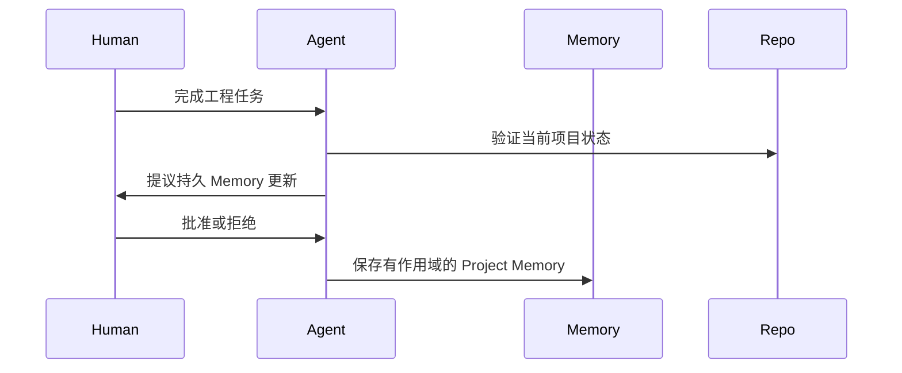

# Project Memory Case

## Scenario

一个产品工程团队在多个服务中使用 AI Coding Agent。早期使用高度依赖重复的人工说明：测试命令、Review 期望、数据库约束和偏好的实现风格，都需要在每次 Session 中重新解释。

团队希望 Agent 能保留持久的项目 Context，同时避免把每个历史任务都带入未来工作。

## Goal

建立 Project Memory 层，在提升一致性的同时避免长期 Context 污染。

成功标准：

- 减少重复的启动说明
- 让持久工程规则持续可用
- 避免保存一次性任务细节
- 让维护者可以 Review Memory

## Implementation

团队定义三类 Memory：

- Project Rules：稳定约定，例如测试策略和编码边界
- Collaboration Preferences：团队希望 Agent 如何提问、提交或总结
- External References：保持权威性的系统链接或名称

他们在每个大型任务结束时增加 Review 步骤：

他们明确拒绝以下 Memory 条目：

- 临时调试假设
- 未经验证且可能变化的文件路径
- 未完成工作的摘要
- 对个人偏好的猜测

## Result

Agent 在运行测试、遵守 Review 边界、定位外部 Context 等重复任务中表现更一致。团队也更少遇到旧任务细节影响新实现决策的情况。

最有价值的改进不只是速度提升，而是减少了每次 Session 开始时反复协商 Context 的成本。

## Lessons Learned

- Project Memory 最适合保存持久规则，而不是活动日志。
- Memory 需要明确 Owner，否则会变成另一个未文档化系统。
- Agent 在基于记忆行动前，应先验证仓库特定断言。
- 将任务观察提升为持久 Memory 时，人工批准很有价值。
- 小而有作用域的 Memory 条目，比宽泛项目摘要更容易 Prune。
