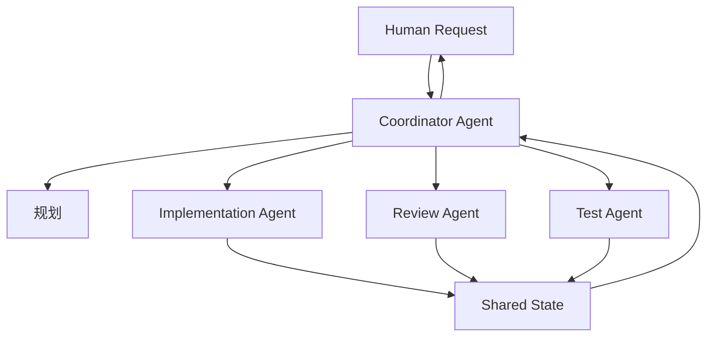

# Coordinator Pattern

## Problem

Multi-Agent Workflow 经常失败，因为每个 Agent 都试图理解整个任务。缺少协调时，Agent 会重复工作、覆盖决策，或为了局部目标优化而与整体 Workflow 冲突。

常见失败模式：

- Implementation Agent 和 Review Agent 使用不同假设
- Agent 重复进行相同的仓库探索
- 任务 State 分散在消息中
- 没有 Agent 对最终集成质量负责

## Solution

引入 Coordinator Agent，负责任务框定、State 跟踪、委派和集成。Coordinator 不需要执行每个子任务，它的价值在于维护共享 Workflow Context。

Coordinator 职责：

- 定义任务目标和验收标准
- 将工作拆分为有边界的子任务
- 分配 Agent 角色
- 维护共享 State
- 解决冲突或升级到 Human Review
- 将结果整合为一致交付

## Architecture

## Example

对于跨模块重构：

1. Coordinator 定义范围和风险区域。
2. Implementation Agent 更新代码。
3. Test Agent 运行验证并报告失败。
4. Reviewer Agent 检查架构一致性。
5. Coordinator 决定继续、修改或升级。

Coordinator 能防止每个 Agent 独立重新定义任务。

## Trade-offs

收益：

- 提升 Multi-Agent Workflow 的一致性
- 减少重复探索
- 明确 State ownership
- 支持关键节点的人类监督

成本：

- 增加协调开销
- 可能成为瓶颈
- 需要清晰的 Shared State 格式
- 对小任务可能不必要

## Best Practices

- 只有任务复杂度足以支撑时才使用 Coordinator。
- 保持委派边界明确。
- 维护一份共享 State 记录，而不是多份私有摘要。
- 要求 Agent 报告证据和产出，而不是宽泛叙述。
- 冲突应升级处理，不要让 Agent 静默选择。
- 将协调与最终 Human Approval 分离。
