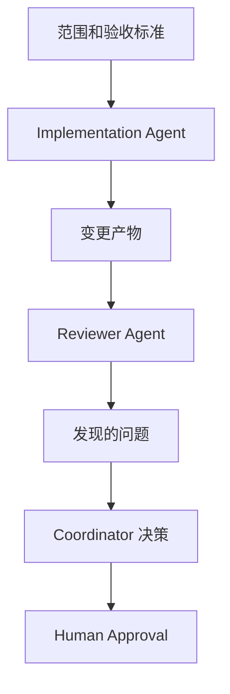

# Multi-Agent Case

## Scenario

一个平台团队使用 AI Agent 支持一次大型文档和工具更新。任务涉及仓库指令、验证脚本和开发者 onboarding 文档。

单 Agent 尝试可以产出局部可接受的编辑，但它把实现、Review 和验证混在同一个 Context 中。团队很难判断哪些决策已经被验证，哪些只是猜测。

## Goal

使用 Multi-Agent Workflow 分离职责，让最终结果更容易 Review。

团队定义三个角色：

- Coordinator Agent：负责范围、State 和集成
- Implementation Agent：负责编辑文件
- Reviewer Agent：负责检查一致性和风险

## Implementation

Coordinator 创建共享 State 文档：

Implementation Agent 只接收有明确范围的编辑任务。Reviewer Agent 接收最终 diff 和验收标准，而不是完整实现对话。

Coordinator 跟踪：

- 已变更文件
- 已运行的验证命令
- 未解决风险
- 需要人类决策的事项

## Result

最终输出更容易审计。由于 Reviewer Agent 不是在为自己的实现路径辩护，Review 反馈更聚焦。Coordinator 也避免把验证失败当成完整任务失败。

团队不会为每个任务都使用 Multi-Agent 模式，而是把该 Pattern 保留给角色分离能提升可靠性的跨领域工作。

## Lessons Learned

- Multi-Agent Workflow 更需要 State 协调，而不是更多 Agent。
- 当假设需要被挑战时，角色分离很有用。
- Shared State 应简洁且结构化。
- Reviewer Agent 需要 diff、需求和约束，而不是无限 Context。
- 集成和 ownership 决策仍需要 Human Approval。
