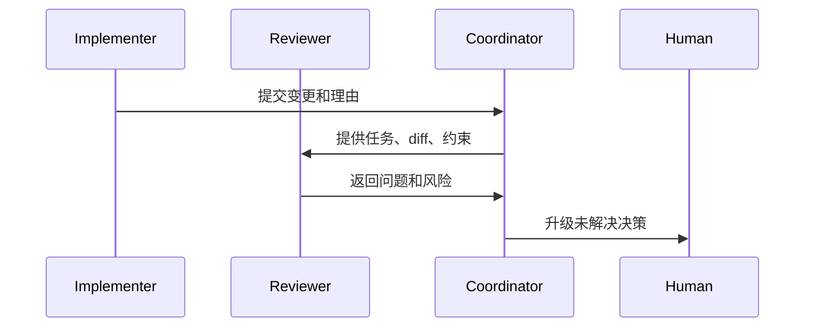

# Reviewer Agent Pattern

## Problem

在 Multi-Agent Workflow 中，负责实现变更的同一个 Agent 也可能评估该变更。这会形成反馈回路：Agent 在 Review 自己的假设，并容易遗漏由这些假设导致的错误。

结果是虚假的信心：

- 生成代码看起来内部一致
- 测试匹配实现，但不匹配需求
- 架构漂移被合理化，而不是被挑战
- 缺失 Context 没有被质疑

## Solution

使用独立的 Reviewer Agent，并为其提供独立角色、Prompt 和输入集。Reviewer Agent 应基于需求、仓库模式和风险 Checklist 检查输出。

Reviewer Agent 职责：

- 挑战假设
- 检查 diff 或产物
- 识别缺失验证
- 检查是否符合项目规则
- 产出按优先级排序的问题

## Architecture

## Example

Implementation Agent 修改 Workflow retry 行为。Reviewer Agent 接收：

- 原始任务
- 相关 diff
- 现有 retry 约定
- 验证结果

它检查 retry 是否幂等、State checkpoint 是否更新，以及测试是否覆盖部分失败。

## Trade-offs

收益：

- 减少自我 Review 偏差
- 提升风险发现能力
- 支持专门的 Review checklist
- 让 Review 发现更容易审计

成本：

- 需要额外打包 Context
- 可能产生重复或低信号问题
- 可能拖慢小变更
- 最终决策仍需要人类判断

## Best Practices

- 尽可能让 Reviewer Agent 独立于实现 Context。
- 提供需求和 diff，而不是完整对话历史。
- 要求基于证据的问题。
- 区分 blocking issue 和 suggestion。
- 不要让 Reviewer Agent 单独批准最终 merge。
- 将重复出现的问题反馈到实现指导中。
