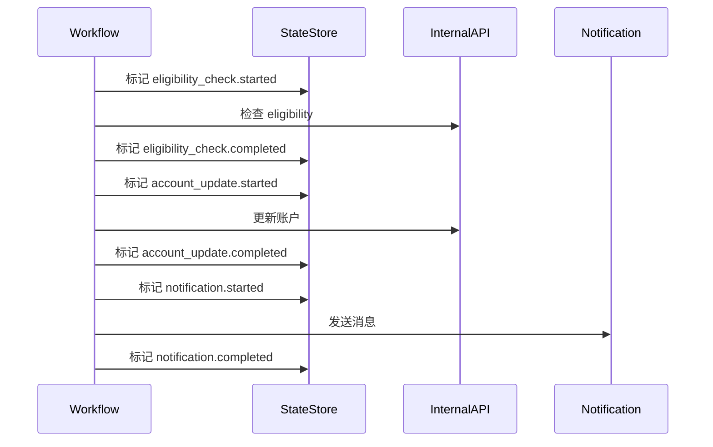

# State Management Case

## Scenario

一个团队为客户 onboarding 运营构建 AI-assisted Workflow。该 Workflow 读取账户数据、检查 eligibility、更新内部系统，并向客户成功团队发送通知。

第一次 demo 表现良好，因为每次运行都从干净 Context 开始并成功完成。

进入生产后，步骤之间开始出现失败。

## Goal

让 Workflow 可恢复，并在重试时防止重复副作用。

团队需要系统知道：

- 什么已经执行
- 什么失败了
- 什么可以安全重试
- 什么需要人工 Review

## Implementation

团队在具有副作用的操作前后增加显式 checkpoint。

通知之后发生失败时，不再重启完整 Workflow。恢复流程读取 State Store，并从正确 checkpoint 继续。

团队还将通知发送标记为不可重复，除非操作员批准第二次发送。

## Result

重试变得更安全。系统在部分失败后不再重复发送通知。操作员可以检查 Workflow State，而不是从聊天记录或分散的服务日志中重建进度。

团队意识到，AI 组件并不是主要可靠性瓶颈，缺失的 State Model 才是。

## Lessons Learned

- Demo Workflow 会掩盖 State 问题，因为它们通常从干净 Context 开始运行。
- 每个外部副作用都应体现在 Workflow State 中。
- Retry 策略必须按步骤定义。
- 幂等 API 有帮助，但不能消除所有重复副作用。
- 对模糊恢复路径，Human Review 应是一等 State。
