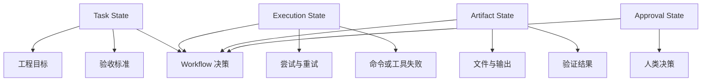

# Task State Design

## Problem

AI 系统经常把任务 State 与执行日志混在一起。一个任务在概念上可能已经完成，但验证仍在运行；实现可能已经完成，但 Review 仍被阻塞。如果 State Model 过于粗糙，系统就无法可靠协调工作。

典型问题包括：

- 已完成工作因为验证 State 丢失而被重试
- 失败命令被当作失败任务
- Human Review 状态隐藏在对话历史中
- 多个 Agent 相互覆盖进度

## Solution

将 Task State 与 Execution State 分离。Task State 描述业务或工程目标，Execution State 描述完成该目标的操作尝试进度。

建议拆分：

- Task State：requested、scoped、implemented、validated、reviewed、accepted
- Execution State：queued、running、failed、retrying、blocked、cancelled
- Artifact State：created、modified、validated、published
- Approval State：pending、approved、rejected

## Architecture

## Example

一个任务写着：“添加 API 验证和测试。”

可能的 State：

- Task State：implemented
- Execution State：validation failed
- Artifact State：源代码和测试已修改
- Approval State：not reviewed

这比把整个任务标记为 failed 更准确。下一步不是重启实现，而是检查验证失败。

## Trade-offs

收益：

- 改善恢复决策
- 帮助 Multi-Agent 协调
- 避免重复已完成工作
- 让人类可见进度

成本：

- 需要维护更多 State 字段
- 需要一致地更新
- 对简单 Workflow 可能显得过重
- 需要明确 State 转换的 Owner

## Best Practices

- 不要用一个 status 字段承载所有含义。
- 将 Human Approval 与执行成功分开追踪。
- 创建文件、消息或外部资源时记录 Artifact State。
- 基于 Execution State 加副作用 State 来做重试决策。
- 保持 State 转换可审计。
- 优先使用明确的 blocked reason，而不是笼统的 failure 标签。
