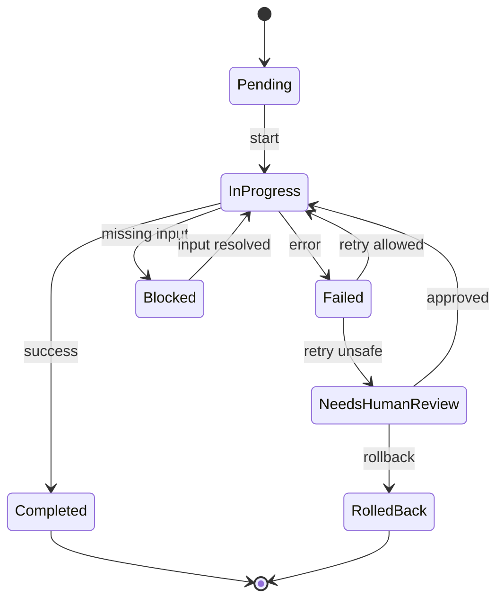

# Workflow State Pattern

## Problem

许多 AI Workflow 一开始只是简单序列：接收任务、生成输出、结束。在真实工程环境中，Workflow 会变长，并包含规划、文件变更、验证、重试、Review 和外部副作用。

如果没有显式 Workflow State，系统无法可靠回答：

- 当前处于哪个步骤
- 哪些步骤已经成功完成
- 哪些失败可以恢复
- 哪些动作造成了外部副作用
- 是否可以安全重试

## Solution

将 AI Workflow 建模为显式 State Machine。每个步骤都应定义进入条件、输出 State、失败 State、重试策略和恢复行为。

核心 State 类别：

- Pending
- In Progress
- Completed
- Failed
- Blocked
- Needs Human Review
- Rolled Back

## Architecture

## Example

文档更新 Workflow 通常可以安全重试，因为再次写入同一文件的外部影响有限。发送客户通知的 Workflow 则不同。一旦通知步骤已运行，重试整个 Workflow 可能导致重复消息。

Workflow State 应记录：

- notification 步骤已开始
- notification provider 返回成功
- notification 之后本地持久化失败
- retry 必须从 notification 步骤之后恢复，而不是之前

## Trade-offs

收益：

- 让长 Workflow 可恢复
- 减少重复执行
- 支持更好的可观测性
- 明确 Human Approval 节点

成本：

- 增加实现复杂度
- 需要 State 存储
- 需要仔细建模副作用
- 对小型一次性任务可能过度

## Best Practices

- 在增加自动化深度前先定义 Workflow State。
- 将外部副作用视为 State 转换。
- 在不可逆动作后保存 checkpoint。
- 为每个步骤明确 retry 行为。
- 对模糊或破坏性操作使用 Human Review State。
- 保持 State 名称稳定，并让操作员容易理解。
