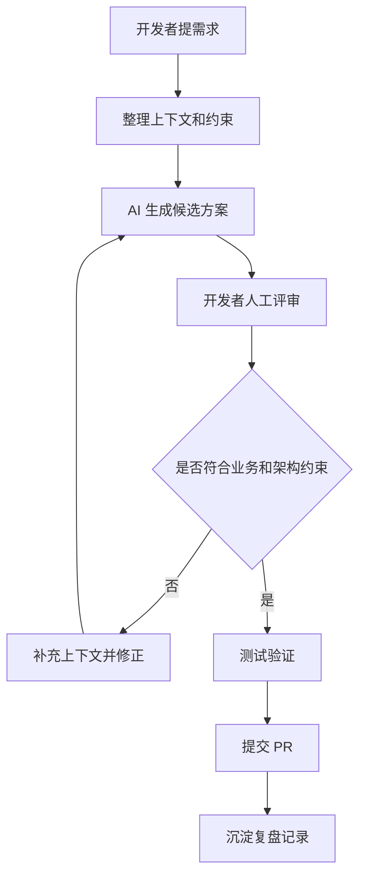

# 上下文正在变成新的技术债

AI Coding 正在改变开发流程。

它不再只是一个“帮我补全代码”的工具，而是逐渐进入需求拆解、代码阅读、Debug、测试补充、PR Review、技术文档整理等环节。

这带来了新的效率空间，也带来了新的工程复杂度：上下文正在变成一种新的技术债。

过去，技术债更多来自代码结构、依赖关系、测试缺口和架构演进。现在，当 AI 开始参与开发流程后，另一类问题开始变得明显：

- AI 是否理解当前系统？
- 当前 Session 是否保留了关键约束？
- Prompt 中的背景是否还能追踪？
- AI 输出是否偏离了架构意图？
- 开发者是否还能复核整个生成过程？

这些问题不会像语法错误一样立刻暴露，但会逐渐影响 Review 成本、协作质量和长期维护性。

---

## 1. AI Coding 开始改变开发流程

<!-- 【背景】：说明 AI Coding 已经进入开发者日常，带来的流程变化 -->

越来越多开发者已经不只是让 AI 写几行代码，而是把 AI 放进完整工作流里。

常见流程正在变成这样：

1. 开发者把需求、错误日志或代码片段交给 AI
2. AI 帮助拆解问题或生成初版实现
3. 开发者继续补充上下文
4. AI 根据新上下文修改方案
5. 开发者 Review、测试、修正
6. 最终形成 PR 或复盘记录

这看起来是效率提升，但它也改变了开发者的工作内容。

开发者不再只是维护代码，还要维护 AI 所依赖的上下文：项目背景、设计约束、命名规则、边界条件、团队习惯，以及那些没有写在代码里的工程判断。

一个真实的 AI Coding Workflow 往往更像这样：

```text
需求描述
  -> Prompt 整理
  -> AI 生成候选方案
  -> 开发者补充上下文
  -> AI 修改实现
  -> 人工 Review
  -> 测试验证
  -> PR 说明和复盘
```

这里真正变化的不是“写代码”这一步，而是开发者开始围绕 AI 组织上下文、验证输出、管理状态。

---

## 2. Prompt 为什么越来越像“临时架构文档”

<!-- 【开发者痛点】：Prompt 越长但上下文丢失问题加重 -->

很多开发者一开始使用 AI 时，Prompt 很短：

```text
帮我写一个订单折扣计算函数。
```

进入真实项目后，Prompt 会逐渐变成这样：

```text
请修改订单结算逻辑，但不要改动已有的 OrderService 接口。

背景：
- 当前项目里订单金额使用 Decimal，不能使用 float
- 折扣逻辑只适用于 paid 状态之前
- 企业客户折扣来自 customer.policy.discount_rate
- 如果 discount_rate 为空，必须按原价计算
- 不能吞掉异常，需要把异常交给上层统一处理
- 请补充单元测试，覆盖普通客户、企业客户和空折扣场景
```

这已经不是一个简单问题，而是一份临时架构文档。

它包含：

- 项目背景
- 架构约束
- 数据类型约定
- 错误处理规则
- 测试要求
- 修改边界

问题在于，这些上下文通常只存在于当前 Session 中。

它们可能不会进入代码注释，不会进入设计文档，也不会进入团队规范。下一次开发者重新打开一个 Session，可能又要重新解释一遍。

Prompt 越长，越说明 AI 需要更多上下文才能工作；但 Prompt 越临时，也越容易形成不可追踪的知识债。

---

## 3. Context Drift 是如何产生的

<!-- 【示例】：展示 Context Drift 的简短 Python 示例 -->

Context Drift 指的是：在持续对话或多轮修改中，AI 对系统约束的理解逐渐偏移。

它不一定表现为明显错误。更常见的情况是，代码看起来合理，但已经偏离了原始业务上下文。

初始 Session 中，开发者说明：

```text
订单折扣必须在税前计算，企业客户有 10% 折扣，普通客户没有折扣。
```

初始代码可能是：

```python
from decimal import Decimal


def calculate_order_total(price, customer_type, tax_rate):
    discount = Decimal("0.9") if customer_type == "enterprise" else Decimal("1.0")
    discounted_price = price * discount
    return discounted_price * (Decimal("1.0") + tax_rate)
```

几轮修改后，Session 里开始加入新的需求：支持优惠券、支持积分、支持税率配置。

AI 后续可能生成：

```python
from decimal import Decimal


def calculate_order_total(price, tax_rate):
    return price * (Decimal("1.0") + tax_rate)
```

这段代码看起来更简单，也能运行。

但企业客户折扣逻辑丢失了。

这就是 Context Drift 的典型问题：AI 没有生成明显坏代码，它只是忘记了之前的业务约束。

这种问题不会立刻报错，却可能逐渐形成：

- 隐性 Bug
- Workflow Drift
- 架构偏移
- 业务规则丢失
- 长期维护风险

当 AI Session 越长、需求越多、约束越分散，Context Drift 出现的概率就越高。

---

## 4. AI Session 为什么越来越难维护

<!-- 【开发者痛点】：上下文窗口限制、prompt 越写越长 -->

很多开发者会发现，AI Session 用得越久，维护成本越高。

一开始，AI 的帮助很直接：解释代码、生成函数、补测试。

但当 Session 变长，开发者会开始做这些事情：

- 反复补充项目背景
- 重复强调不要修改某些接口
- 重新解释错误处理约定
- 纠正 AI 忘记的命名规则
- 提醒 AI 前几轮已经做过的决策
- 手动整理当前任务状态

最终，开发者维护的已经不只是代码，而是 AI 的上下文状态。

这是一种新的工作负担。

过去，状态管理更多发生在代码里：数据库状态、缓存状态、应用状态、任务状态。

现在，AI Workflow 里也出现了状态管理：

- 当前 Session 记住了什么？
- 哪些约束仍然有效？
- 哪些决策已经过期？
- 哪些输出已经被人工否定？
- 哪些上下文需要进入长期文档？

如果这些状态没有被显式管理，AI Session 就会逐渐变成一个难以复核的临时空间。

---

## 5. 为什么 AI 输出越多，Review 越重要

<!-- 【示例】：Review Burden 示例 -->

AI 输出越多，Review 并不会变得不重要。相反，Review 会变得更重要。

原因是 AI 生成的代码通常具有一种“表面完整性”：格式规范、结构清楚、变量命名看起来合理，甚至能通过部分测试。

但这不代表它没有风险。

例如：

```python
def save_profile(user):
    try:
        save_user(user)
    except:
        pass
```

这段代码：

- 能运行
- 不报错
- 可能通过简单测试
- 看起来像是在做异常保护

但它隐藏了异常。

真实工程里，这可能导致：

- 用户资料保存失败却没有告警
- 上游流程误以为操作成功
- 日志和监控缺失
- 后续排查问题时没有线索

AI Review Burden 的核心不只是“代码有没有 bug”，而是开发者需要判断：

- 这段代码是否符合错误处理策略？
- 是否破坏了可观测性？
- 是否隐藏了业务失败？
- 是否增加了未来排查成本？

AI 越能快速生成大量内容，人工 Review 越需要关注长期维护风险，而不是只看代码能不能运行。

---

## 6. AI Workflow 为什么开始依赖状态管理

<!-- 【工作流分析】：说明 AI Workflow 中状态管理的重要性 -->

当 AI 只处理一次性任务时，状态管理并不明显。

但当 AI 开始参与完整开发流程，状态就变得重要：

```text
Issue 背景
  -> 设计约束
  -> Prompt 约束
  -> AI 输出
  -> 人工修改
  -> 测试结果
  -> Review 反馈
  -> 最终决策
```

这些信息如果只停留在对话中，就很难追踪。

一个更可靠的 AI Workflow，需要把关键状态显式化：

- 哪些上下文是事实
- 哪些内容是假设
- 哪些建议被采纳
- 哪些建议被拒绝
- 哪些风险需要 Review
- 哪些结论需要进入文档或测试

这也是为什么 AI Coding 的核心开始从 Prompt Engineering 走向 Context Engineering。

Prompt 解决的是“如何提问”。

Context Engineering 解决的是“如何让 AI 持续理解系统，并让开发者能复核这种理解”。

---

## 7. Human-in-the-loop Workflow 示例

<!-- 【Mermaid 示例】：AI 与人工协作流程 -->

真正有效的 AI Workflow，通常不是“AI 自动完成开发”，而是“AI + Human Review + Workflow Validation”。



这个流程里，AI 的作用不是取代开发者，而是帮助开发者更快形成候选方案和检查点。

Human-in-the-loop 的价值在于：

- 判断业务语义是否正确
- 判断架构方向是否一致
- 判断风险是否可接受
- 判断 AI 输出是否值得进入代码库
- 把一次性交互沉淀为长期知识

没有人工参与，AI Workflow 很容易从“效率提升”变成“风险转移”。

---

## 8. 真正的问题不是生成，而是状态连续性

很多人讨论 AI Coding 时，会关注：

- 幻觉
- 准确率
- 代码能力
- 模型强弱

这些问题重要，但在真实工程环境里，另一个问题更容易影响长期效率：状态连续性。

更难的不是 AI 能不能生成代码，而是：

- AI 是否持续理解当前系统？
- AI 是否记得前几轮已经确认过的约束？
- AI 是否能区分事实、假设和过期信息？
- AI 是否能沿着团队已有架构继续工作？
- 开发者是否能复核 AI 为什么这样生成？

当上下文连续性不足时，AI 可能每一轮都看起来“答得不错”，但整体方向逐渐偏离。

这类偏离会带来 Architecture Misalignment：代码表面完成了任务，但逐渐远离系统原本的边界和约定。

---

## 我的观察与思考

AI Coding 并不是单纯提高写代码速度，它正在改变开发者的协作模式。

我越来越倾向于把 AI Coding 看作一种工作流能力，而不是单点工具能力。

几个观察比较明确：

- Prompt 越长，越像临时架构文档
- Context 管理正在成为新的工程能力
- AI Session 越长，越需要显式状态管理
- AI 输出越多，Review 越重要
- Human-in-the-loop 不是保守，而是可靠工程的一部分
- 真正的问题不是生成能力，而是上下文连续性

如果团队没有意识到这些变化，AI 很容易带来一种错觉：局部速度变快了，但整体复杂度增加了。

这正是“上下文成为技术债”的原因。

---

## 总结

AI Coding 正在快速进入真实开发流程。

但真正值得关注的，已经不只是“AI 会不会写代码”，而是“AI 如何持续理解系统”。

未来的软件工程复杂度，可能不再只来自代码本身，还会来自：

- Context
- Workflow
- Session State
- Human-AI Collaboration
- Review Burden
- Architecture Alignment

如果这些内容没有被管理，它们就会像传统技术债一样积累。

更好的方向不是让 AI 独立完成更多工作，而是让 AI Workflow 更清晰，让上下文更可追踪，让人工判断更容易介入，让有效经验能够被长期沉淀。

这可能才是 AI Developer Experience 接下来真正需要关注的地方。
