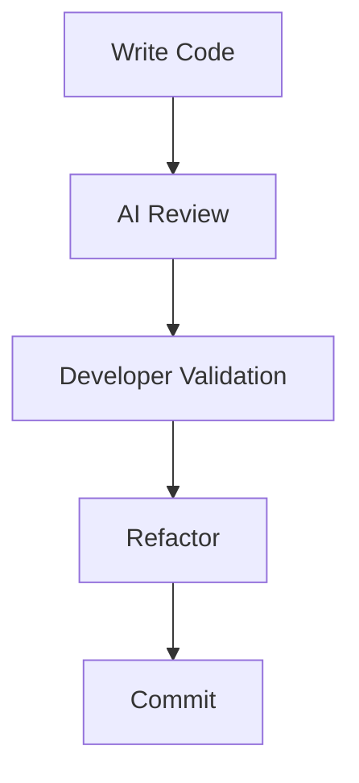

# AI Code Review Workflow

## 场景

开发者提交一段代码后，AI 先从可读性、命名、异常处理和潜在优化点进行初步 Review。

这个过程不是为了让 AI 直接决定代码是否可以合并，而是让开发者更早看到可能需要检查的地方。最终判断仍然由开发者和人工 Review 承担。

```text
开发者提交代码 → AI Review → 人工确认 → 修改代码 → 最终提交
```

## Mermaid 流程图



## Workflow 分析

### AI 的优势

- 可以快速扫描常见可读性和命名问题
- 可以提示异常处理、边界条件和重复模式
- 可以帮助开发者在正式 Review 前补充检查点
- 可以把 Review 从“只看代码”扩展到“检查意图和风险”

### AI 的局限

- 不一定理解业务语义和团队约定
- 可能提出看似合理但不适合当前项目的建议
- 无法替代测试、运行验证和人工判断
- 对上下文不足的代码容易给出泛化建议

### 为什么 Human-in-the-loop 很重要

AI Review 更适合作为开发者的辅助检查层，而不是最终裁决者。

开发者需要确认：

- 建议是否符合业务上下文
- 修改是否值得引入额外复杂度
- 风险是否已经通过测试或人工检查覆盖
- 代码是否符合团队长期维护方式

Human-in-the-loop 的价值在于把 AI 的速度和开发者的判断结合起来。AI 负责提出候选问题，开发者负责确认问题是否真实、是否值得修复，以及如何修复。
