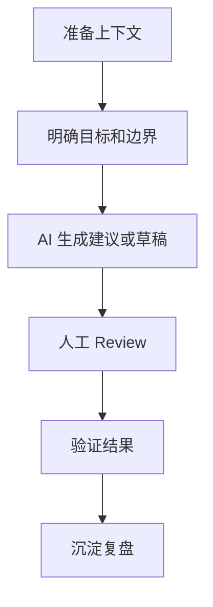

# 场景

说明工作流适用的开发场景、参与角色和输入材料。

# Workflow

1. 准备上下文
2. 明确任务目标和边界
3. 让 AI 生成分析、建议或草稿
4. 人工 Review 和修正
5. 验证结果
6. 沉淀复盘记录

# Mermaid 流程图

# 优势

- 降低重复整理成本
- 加快初步分析和草稿生成
- 帮助团队形成可复用检查点

# 风险

- 上下文不足导致输出偏差
- AI 输出看似完整但缺少验证
- 责任边界不清会增加 Review 成本

# 注意事项

- 明确哪些环节必须人工判断
- 保留关键决策和验证记录
- 不把单次成功直接扩展为通用流程
