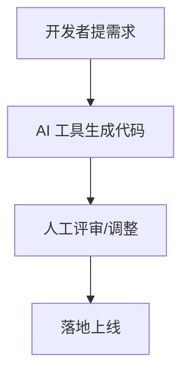

# {{ 工作流标题 }}

# 场景

<!-- 【场景】：说明工作流适用的开发场景、参与角色、输入材料和约束条件 -->

{{ 具体适用场景，如 Bug 排查、代码 Review、测试补充、需求拆解或 Prompt 协作。 }}

# Workflow

<!-- 【Workflow】：按步骤描述 AI 与开发者如何协作，保留人工确认环节 -->

1. {{ 开发者准备上下文 }}
2. {{ AI 生成分析、建议或草稿 }}
3. {{ 开发者验证输出并判断是否采用 }}
4. {{ 根据确认结果进行修改 }}
5. {{ 运行测试或补充验证 }}
6. {{ 沉淀复盘记录 }}

# Mermaid 流程图

<!-- 【Mermaid 流程图示例】：粘贴 Mermaid 流程图代码，可直接替换 -->

# 优势

<!-- 【优势】：说明该工作流对开发者体验、反馈速度或协作质量的具体帮助 -->

- {{ 降低上下文整理成本 }}
- {{ 提前暴露风险和检查点 }}
- {{ 让 Review 或协作过程更可复核 }}

# 风险

<!-- 【风险】：说明 AI 输出可能带来的偏差、误用或额外验证成本 -->

- {{ 上下文不足导致建议泛化 }}
- {{ AI 输出看似完整但缺少验证依据 }}
- {{ 人工责任边界不清导致 Review 成本增加 }}

# 注意事项

<!-- 【注意事项】：记录使用该工作流时需要长期遵守的边界和检查点 -->

- {{ 明确哪些环节必须人工判断 }}
- {{ 保留关键决策和验证记录 }}
- {{ 不把单次成功直接扩展为通用流程 }}
